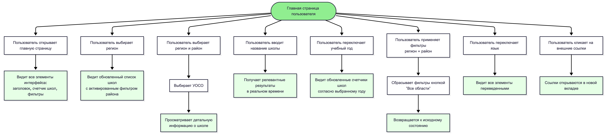
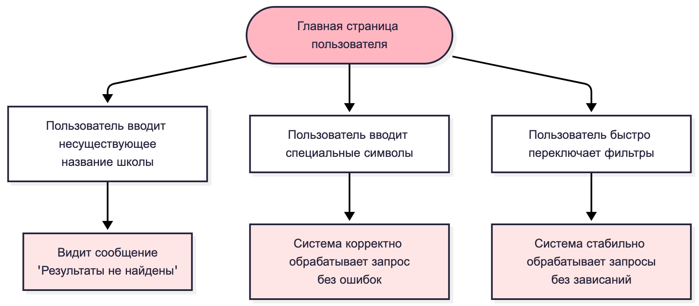
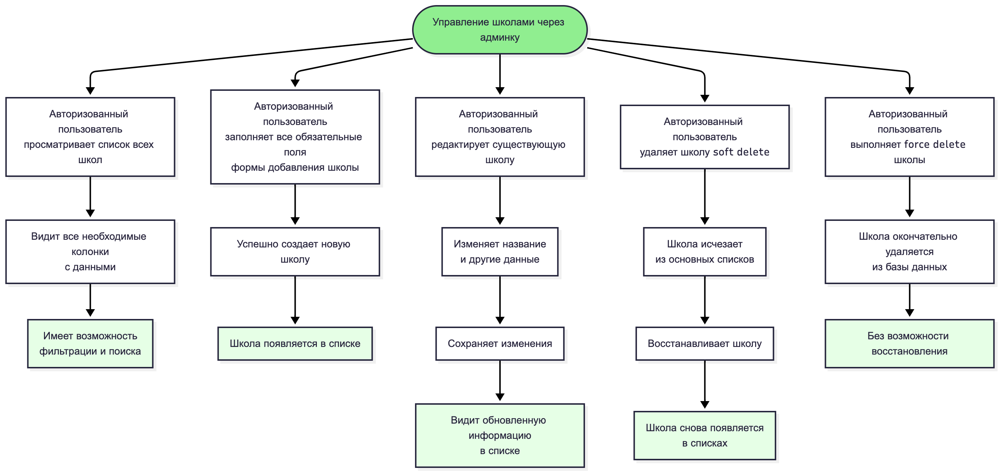
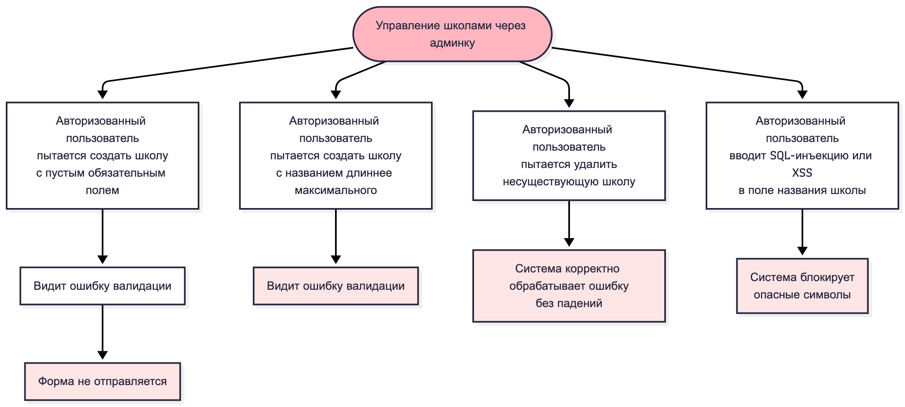
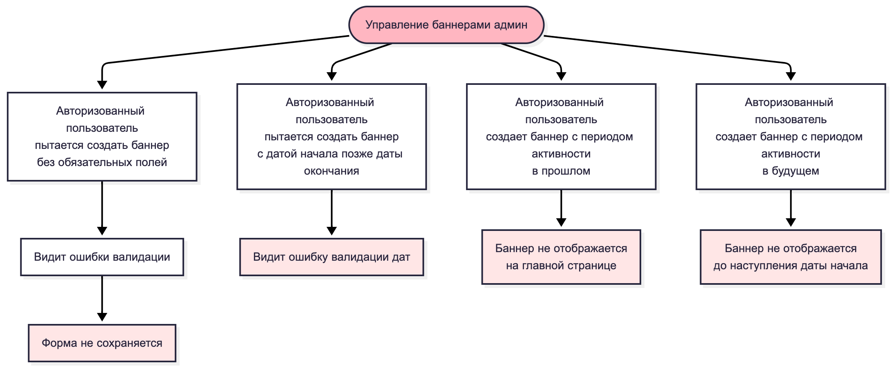

# Тестовые сценарии

## Модуль 1: Главная страница пользователя

### Позитивные сценарии

1. Пользователь открывает главную страницу и видит все необходимые элементы интерфейса (заголовок, счетчик школ, фильтры)
2. Пользователь выбирает регион из фильтра и видит обновленный список школ с активированным фильтром района
3. Пользователь выбирает регион и район, затем выбирает УОСО и просматривает детальную информацию о школе
4. Пользователь вводит название школы в поле поиска и получает релевантные результаты в реальном времени
5. Пользователь переключает учебный год и видит обновленные счетчики школ согласно выбранному году
6. Пользователь применяет фильтры (регион + район) и сбрасывает их кнопкой "Все области", возвращаясь к исходному состоянию
7. Пользователь переключает язык интерфейса и видит все элементы переведенными
8. Пользователь кликает на внешние ссылки в футере и они открываются в новой вкладке

### Негативные сценарии

9. Пользователь вводит несуществующее название школы в поиск и видит сообщение "Результаты не найдены"
10. Пользователь вводит специальные символы в поле поиска и система корректно обрабатывает запрос без ошибок
11. Пользователь быстро переключает фильтры и система стабильно обрабатывает запросы без зависаний

## Модуль 2: Страница "Список всех УОСО"

### Позитивные сценарии

12. Пользователь открывает страницу "Список всех УОСО" и видит полный список школ с возможностью фильтрации
13. Пользователь фильтрует список по типу учебного заведения и видит только школы выбранного типа
14. Пользователь сортирует список по региону и видит отсортированные данные с индикатором направления сортировки

### Негативные сценарии

15. Пользователь применяет несколько фильтров одновременно и система корректно обрабатывает комбинацию условий
16. Пользователь вводит несуществующее название школы в поиск и видит сообщение "Результаты не найдены"
17. Пользователь вводит специальные символы в поле поиска и система корректно обрабатывает запрос без ошибок
18. Пользователь быстро переключает фильтры и система стабильно обрабатывает запросы без зависаний
19. Пользователь вводит очень длинный текст в поиск и система корректно обрабатывает или ограничивает длину
20. Пользователь пытается отсортировать пустой список и система корректно обрабатывает ситуацию без ошибок

## Модуль 3: Админка - Авторизация

### Позитивные сценарии

21. Пользователь вводит валидные email и пароль, нажимает "Войти" и успешно попадает в админку
22. Авторизованный пользователь нажимает "Выйти" и успешно разлогинивается с перенаправлением на страницу входа
23. Авторизованный пользователь работает в системе, токен истекает, система автоматически обновляет токен без прерывания работы

### Негативные сценарии

24. Пользователь вводит неверный email или пароль и видит сообщение об ошибке авторизации, оставаясь на странице входа
25. Пользователь пытается войти с пустыми полями и видит ошибки валидации для обязательных полей
26. Пользователь вводит неверные данные 5 раз подряд и получает блокировку (rate limit) с сообщением об ошибке 429
27. Неавторизованный пользователь пытается получить доступ к админке по прямой ссылке и перенаправляется на страницу входа
28. Пользователь вводит SQL-инъекцию в поля авторизации и система блокирует попытку без выполнения запроса
29. Пользователь с ролью Manager пытается выполнить действие, доступное только Админу, и получает ошибку доступа

## Модуль 4: Управление школами через админку

### Позитивные сценарии

30. Авторизованный пользователь просматривает список всех школ с возможностью фильтрации и поиска, видит все необходимые колонки с данными
31. Авторизованный пользователь заполняет все обязательные поля формы добавления школы и успешно создает новую школу, которая появляется в списке
32. Авторизованный пользователь редактирует существующую школу, изменяет название и другие данные, сохраняет изменения и видит обновленную информацию в списке
33. Авторизованный пользователь удаляет школу (soft delete), она исчезает из основных списков, затем восстанавливает ее и она снова появляется в списках
34. Авторизованный пользователь выполняет force delete школы и она окончательно удаляется из базы данных без возможности восстановления

### Негативные сценарии

35. Авторизованный пользователь пытается создать школу с пустым обязательным полем и видит ошибку валидации, форма не отправляется
36. Авторизованный пользователь пытается создать школу с названием длиннее максимально допустимого и видит ошибку валидации
37. Авторизованный пользователь пытается удалить несуществующую школу и система корректно обрабатывает ошибку без падений
38. Авторизованный пользователь вводит SQL-инъекцию или XSS в поле названия школы и система блокирует опасные символы

## Модуль 5: Статистика по годам через админку

### Позитивные сценарии

39. Авторизованный пользователь просматривает статистику по учебным годам и видит данные по классам и количеству учащихся в удобном формате
40. Авторизованный пользователь просматривает дополнительную статистику и видит корректные расчеты и представление данных
41. Авторизованный пользователь создает новую запись статистики для учебного года с данными по классам и она успешно сохраняется
42. Авторизованный пользователь редактирует существующую запись статистики, изменяет значения по классам и видит пересчитанные агрегаты и обновленные графики
43. Авторизованный пользователь удаляет запись статистики и оставшиеся данные отображаются корректно без ошибок

### Негативные сценарии

44. Авторизованный пользователь пытается создать запись статистики с годом, который уже существует, и видит ошибку уникальности
45. Авторизованный пользователь пытается создать запись статистики с отрицательным количеством классов и видит ошибку валидации
46. Авторизованный пользователь пытается ввести текст вместо числа в поле количества классов и видит ошибку валидации типа данных

## Модуль 6: Управление баннерами (админ)

### Позитивные сценарии

47. Авторизованный пользователь просматривает список всех баннеров и видит их статусы (активный/неактивный) с возможностью управления
48. Авторизованный пользователь создает новый баннер, заполняет все обязательные поля, устанавливает период активности и баннер появляется в списке
49. Авторизованный пользователь переключает статус баннера с неактивного на активный и баннер начинает отображаться на главной странице
50. Авторизованный пользователь создает баннер с периодом активности (дата начала и окончания), баннер показывается только в указанный период
51. Авторизованный пользователь активирует баннер в админке и видит его отображение на клиентской части главной страницы

### Негативные сценарии

 

52. Авторизованный пользователь пытается создать баннер без обязательных полей и видит ошибки валидации, форма не сохраняется
53. Авторизованный пользователь пытается создать баннер с датой начала позже даты окончания и видит ошибку валидации дат
54. Авторизованный пользователь создает баннер с периодом активности в прошлом и баннер не отображается на главной странице
55. Авторизованный пользователь создает баннер с периодом активности в будущем и баннер не отображается до наступления даты начала